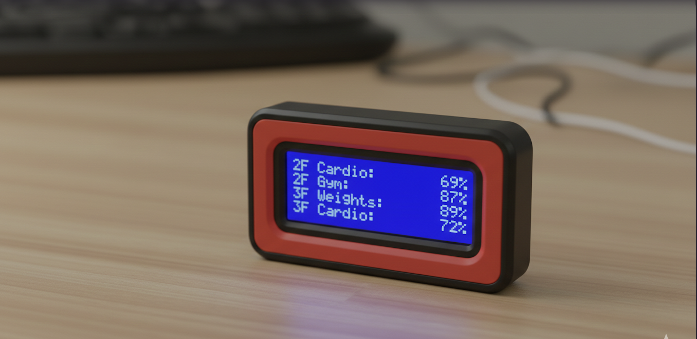
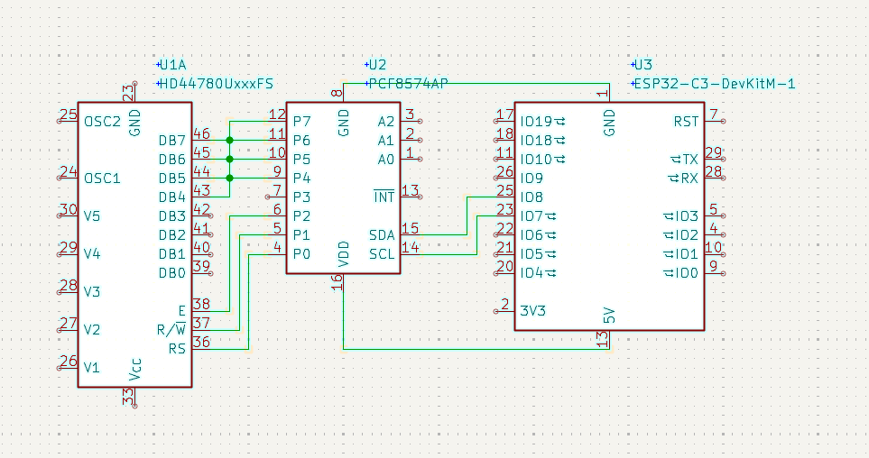

# Husky Gym Tracker

Real-time gym occupancy tracker for Northeastern University's Marino Center, displayed on an ESP32-powered LCD screen.

## Demo





## Hardware Required

- ESP32 board
- 20x4 I2C LCD display (PCF8574)
- WiFi connection

## Setup

1. **Configure WiFi** - Edit `marino_api.py`:

   ```python
   WIFI_SSID = "your-wifi-name"
   WIFI_PASSWORD = "your-password"
   ```

2. **Upload files** to ESP32 using a tool like [Thonny](https://thonny.org/) or `ampy`:

   ```bash
   ampy --port /dev/ttyUSB0 put boot.py
   ampy --port /dev/ttyUSB0 put main.py
   ampy --port /dev/ttyUSB0 put marino_api.py
   ampy --port /dev/ttyUSB0 put lcd_pcf8574.py
   ```

3. **Wiring**:
   - LCD SDA → GPIO 25
   - LCD SCL → GPIO 33
   - Backlight PWM → GPIO 26

## How to Run

The device automatically starts on boot and displays:

- 2F Cardio occupancy
- 2F Gym occupancy
- 3F Weights occupancy
- 3F Cardio occupancy

Updates every 10 minutes from Cloudflare Worker API.

## Features

- Auto-connects to WiFi on startup
- Fetches real-time occupancy data
- Clean 4-line display format
- Auto-refresh every 10 minutes
